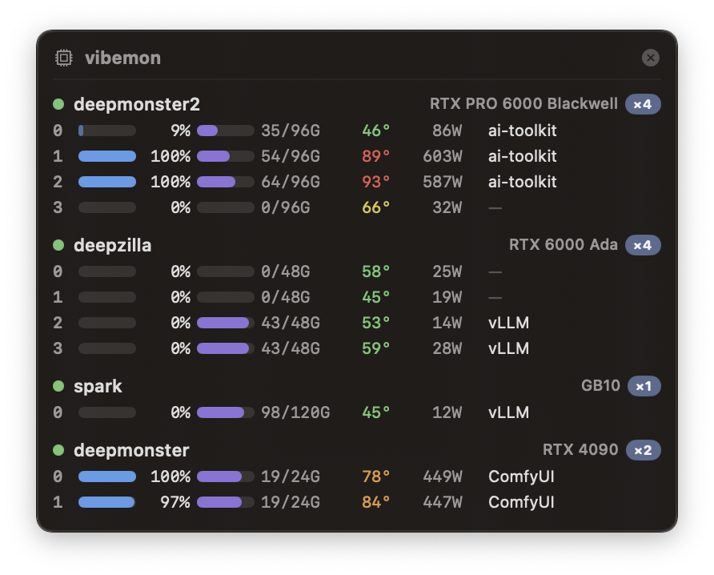

# vibemon

A floating macOS panel that keeps an eye on a fleet of Linux AI servers — per-GPU
compute, VRAM, temperature, power draw, and what each card is running.



Nothing gets installed on the servers. The Mac opens one persistent `ssh` connection per
host, pipes a small bash loop in over stdin, and parses what comes back.

## Requirements

- macOS 14+
- `nvidia-smi` on each server (you have it if NVIDIA drivers are installed)
- Passwordless SSH to each host (key-based; hosts can be `~/.ssh/config` aliases)

## Install

```sh
git clone git@github.com:blucz/vibemon.git
cd vibemon
./script/build_app.sh
cp -R .build/app/vibemon.app /Applications/
open /Applications/vibemon.app
```

Click the gauge icon in the menu bar to show/hide the panel or enable Open at Login.

## Configure your hosts

Edit `Sources/gpumon/main.swift`:

```swift
let hostConfigs: [HostConfig] = [
    HostConfig("deepmonster"),
    HostConfig("deepzilla"),
    HostConfig("spark"),
]
```

Each string is an SSH alias or hostname. Rebuild with `./script/build_app.sh`.

## How it works

Each host gets one long-lived `ssh host bash -s` process. The remote bash is fed a tiny
loop over stdin that emits a block of stats every two seconds:

- `nvidia-smi --query-gpu=...` for compute, memory, temperature, power
- `nvidia-smi --query-compute-apps=...` for the PIDs using each GPU
- `/proc/<pid>/cmdline` and `/proc/<pid>/cwd` to figure out what's actually running

Known frameworks (vLLM, ComfyUI, llama.cpp, SimpleTuner, ai-toolkit, kohya, Axolotl,
Unsloth, SGLang, Ollama, TGI, DeepSpeed, …) get friendly labels by matching against the
combined cmdline + cwd + process name. Custom jobs fall back to the project directory
name, then the python script name.

Each ssh is wrapped in a small shell watcher that kills its ssh child if vibemon dies —
so no remote loops get left running, even if the app is `kill -9`'d.

## Special cases

- **DGX Spark / GB10** — integrated GPU, so `nvidia-smi` returns N/A for memory and
  power limit. Memory falls back to system RAM (it's unified anyway).
- **Driver/library version mismatch** on a host — shown as a warning state ("reboot
  needed") instead of silently zeroing out the row.
- **Monitors come and go** — the panel position is saved on every move. On launch (or
  when displays change live), if the saved rect no longer overlaps any screen, the panel
  hops back to top-right of the main display.

## Adding your own job labels

`Sources/gpumon/JobLabeler.swift`. The `frameworks` array is just substrings matched
against `cmdline + cwd + process_name`, lowercased. Order matters — more specific
needles first.
